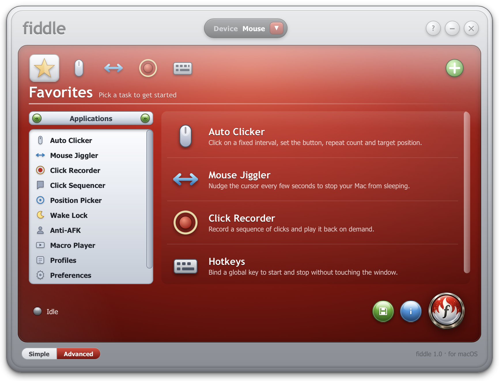
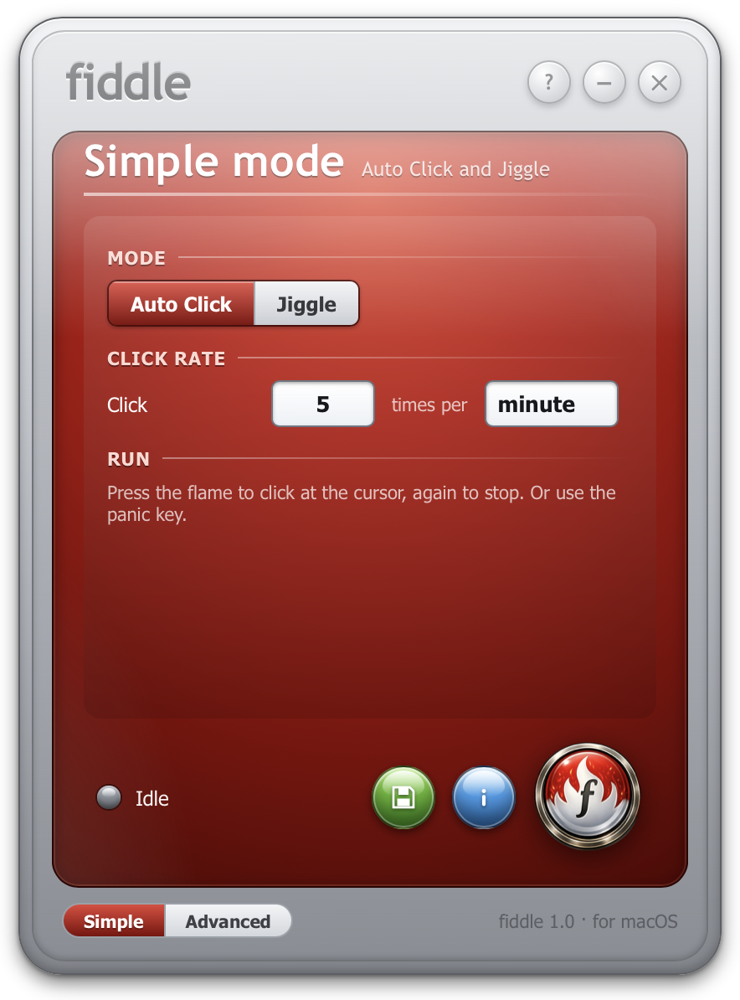
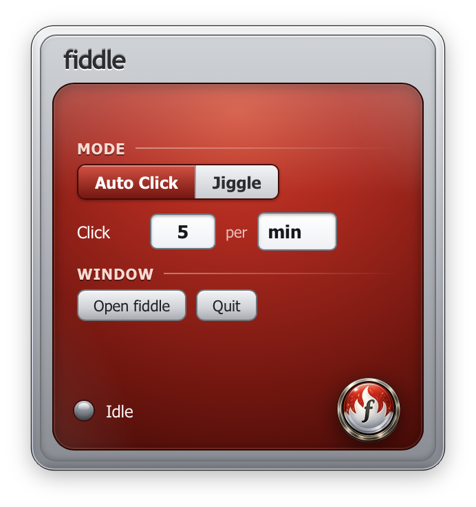

<p align="center">
  
</p>

<p align="center">
  
</p>

<p align="center">
  <strong>A native macOS auto-clicker and mouse jiggler wearing an early-2000s skeuomorphic skin.</strong><br/>
  Click on an interval or a rate, jiggle the cursor so your Mac never sleeps, hold the display awake, record and replay clicks, run key sequences, and drive all of it with global hotkeys, including a panic key that stops everything.<br/><br/>
  Nero fiddled while Rome burned. fiddle fiddles with your mouse while you are away.
</p>

<p align="center">
  <a href="#why">Why</a> ·
  <a href="#features">Features</a> ·
  <a href="#install">Install</a>
</p>

<p align="center">
  
  
  
  
</p>

<p align="center">
  
</p>

---

## Why

You know the tools. The auto-clicker that looks like a tax form, the jiggler bundled with a toolbar you never asked for, the one-trick menu-bar app hiding behind a plain gray sheet. The jobs themselves are genuinely useful: keep the Mac awake through a long download, click through a tedious prompt a few hundred times, look present while you step away from your desk. The software for them is almost always grim.

fiddle does those jobs in a single fast window that looks like it fell out of 2003: a brushed-chrome bezel, a glossy red stage, beveled candy-orb buttons. It is an affectionate homage to the Nero StartSmart launcher, and the name is the whole joke. Nero fiddled while Rome burned. fiddle fiddles with your mouse while you are away.

---

## Features

### Auto Clicker

- Click on a precise **interval** (hours / minutes / seconds / milliseconds in Advanced) or a continuous **rate** (N clicks per second or per minute in Simple and the menu bar)
- Choose the **left, right, or middle** button, **single or double** click (a real double sets the click-state field so apps register it as one)
- Repeat a **set number of times** or **until you stop**
- Click at the **current cursor** or a **fixed picked position**, set with the Position Picker

### Mouse Jiggler

- Nudge the cursor every few seconds so the Mac never sleeps
- **Zen mode** moves the pointer and returns it, so it does not slowly walk across the screen over hours; **Visible mode** leaves it where it lands
- **Keep display awake** holds an IOKit display-sleep assertion while it runs
- **Idle-only mode** pauses jiggling while you are actively using the Mac, and resumes when you step away

### Wake Lock and Anti-AFK

- **Wake Lock** holds the display and / or the system awake with IOKit assertions and no cursor movement at all, the same mechanism behind `caffeinate`
- **Anti-AFK** does the periodic-nudge job as its own preset, for apps that watch for activity rather than sleep

### Click Recorder and Macro Player

- **Record** real clicks through a listen-only `CGEvent` tap, with their positions and timing, and **play them back** a set number of times or until you stop. fiddle filters out clicks on its own window so the recording stays clean
- **Build macro sequences** of click, wait, and move steps and play them through the same engine
- The recorder needs the **Input Monitoring** permission, and playback needs **Accessibility**, both surfaced clearly in the UI

### Keyboard mode

- Flip the **Device** pill to Keyboard to turn the clicker into an **auto-presser**: press a chosen key on an interval, with the same repeat controls

### Global hotkeys

- **Start / stop** (F6), **toggle the jiggler** (F7), **pick a position** (Control-Option-P), and a **panic key** (Command-Escape) that force-stops every engine instantly, even when fiddle is not the focused app
- **Rebind** any of them in-app by clicking the keycap and pressing the new combo

### Two faces, plus the menu bar

- **Simple mode** is just Auto Click or Jiggle with a rate, for when you want one thing fast
- **Advanced mode** is the full sidebar: every tool above, profiles, and the activity log
- A **menu-bar popover** renders the same skin as a compact "mini fiddle," and it stays live-synced with the main window: start in one and the other's status LED and the menu-bar flame follow

<p align="center">
  
  &nbsp;&nbsp;
  
</p>

### Profiles and Activity Log

- Save the full configuration as a **named profile** and apply it again later in one click
- A running **activity log** records what started and stopped and when

### Throughout

- **Four skins**: Nero Red (default), Cobalt, Graphite, and Emerald, themed through CSS custom properties so the chrome and layout stay fixed
- **Preferences**: launch at login, menu-bar-only mode, and an optional click sound, all persisted
- **A permission flow that explains itself**: fiddle detects missing Accessibility or Input Monitoring, tells you which is needed and why, and deep-links straight to the right System Settings pane

---

## Install

### Download

Grab the signed, notarized build from the [latest release](https://github.com/umzcio/fiddle/releases/latest), open it, and drag **fiddle** to Applications.

On first launch, fiddle asks for the **Accessibility** permission, which macOS requires for any app that synthesizes or taps input. Grant it in System Settings, then relaunch. The Click Recorder additionally asks for **Input Monitoring** the first time you record. fiddle explains each one and links you straight to the right pane.

### Build from source

**Prerequisites**

- Xcode 15 or later (Swift 5.9, the macOS 14 SDK)
- macOS 14 Sonoma or later

```bash
git clone https://github.com/umzcio/fiddle.git
cd fiddle

# open in Xcode and Run (Cmd+R)
open Fiddle.xcodeproj

# or from the command line
xcodebuild -scheme Fiddle -configuration Debug build
```

The first run prompts for Accessibility. Grant it in System Settings, then relaunch.

---

## Naming and legal

fiddle is an affectionate homage to the Nero StartSmart launcher and its era of skeuomorphic software. The original brand name is never used in the product, and none of its logo or trade dress is reproduced. fiddle's flame mark is its own original artwork. Homage, not affiliation.

## Contributing

Issues and pull requests are welcome. Please keep the Nero look identical and follow the existing conventions (American spelling, no em dashes in user-facing copy).

## License

[MIT](LICENSE). Use it, fork it, keep the flame.

---

<p align="center">
  <em>Idle or Running, the flame is always lit.</em><br/>
  <sub>fiddle. It fiddles with your mouse while you are away.</sub>
</p>
